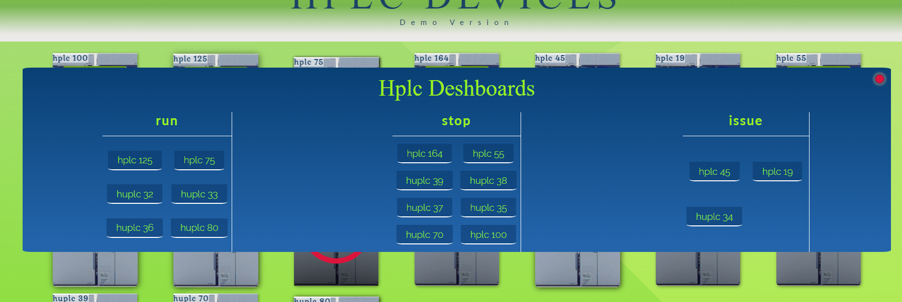

# HPLC DEVICES MANAGEMENT

## overView
> HPLC devices managmant App allows to the team leader to organzie and manage the HPLC devices in the laboratory by attach every device to employee and set the status of every device and keep the current setting by save it on **local storage**
  
## Technologies
+ HTML
+ CSS
+ Javascript

## Detailed explanation
> When the use is hover on the HPLC image he can set one status of the three states that exist

### Status - run
> When the team leader wants to attach to employee an HPLC device, he click on the "FILL DETAILS" Button and add the relevant details on the back of the card

>After save the details he can return back to the front face and set the status to run - an animation will start indicates that this device is in use, the name of the project will show on the device

### Status - stop
>if the device is not occupied the status that should be given is "stop" that indicate that the device is not occupied and free to attached it to work performance

### Status - issue
>the "issue" status indicate that the device has problem and not available for work

## Dashboard pannel
>A Dashboard panel can be opened from the button on the right corner The dashboard panel is summarization of all the devices with their status

